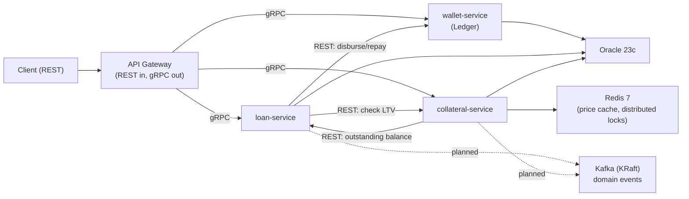
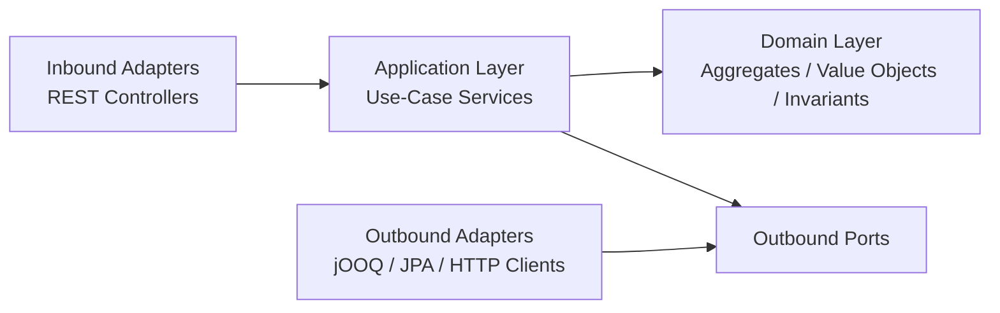

<div align="center">

# PayGuard

**A privacy-focused, secure modular fintech backend for wallet ledgering, loan origination, and digital-collateral risk management.**

[](#)
[](https://openjdk.org)
[](https://spring.io/projects/spring-boot)
[](https://alistair.cockburn.us/hexagonal-architecture/)
[](LICENSE)

[Overview](#overview) •
[Services](#services) •
[Architecture](#architecture) •
[Key Engineering Decisions](#key-engineering-decisions) •
[Getting Started](#getting-started) •
[API Documentation](#api-documentation) •
[Roadmap](#roadmap)

</div>

---

## Overview

PayGuard is a **privacy-focused** and **security-first** backend system designed for a single, coherent financial story: a customer locks digital assets as collateral, borrows against them, and pays the loan back — while the system continuously monitors the collateral's value and protects itself automatically if that value falls too far.

Built on the principle that sensitive systems should run entirely on your own hardware to keep data completely private[cite: 2], PayGuard is designed to be self-hosted, ensuring you retain absolute control over financial records. The project is constructed as a set of **independently deployable microservices**, each owning its own completely isolated database. They communicate only through explicit contracts — never through a shared schema — bringing the risk of data leakage to absolute zero.

It is a deliberate engineering exercise in the domain problems that sit underneath every regulated lending product, executed with the highest security standards:

- **Immutable and privacy-preserving ledgers:** Double-entry bookkeeping and derived, never-stored balances to eliminate data tampering.
- **Secure and idempotent financial operations:** Guaranteed transaction integrity under concurrent access.
- Loan amortization, repayment waterfalls, and delinquency state machines built for strict auditability.
- Loan-to-Value (LTV) risk monitoring, margin calls, and liquidation via protected, automated mechanisms.
- **Strict service-to-service communication boundaries:** REST at the edge for external clients, and secure gRPC where internal latency and security matter.

It is not a payment-card switch or a full core-banking platform. The scope is intentionally narrow so that every part of the architecture can be built, understood, and defended in depth against security vulnerabilities.

---

## Core Capabilities

### Implemented / In Progress

- [ ] Account creation and double-entry ledger posting (`wallet-service`)
- [ ] Hold → capture → release flow for provisional balance reservations
- [ ] Loan application, approval, and amortization-schedule generation (`loan-service`)
- [ ] Repayment waterfall (fees → interest → principal)
- [ ] Collateral locking and Loan-to-Value calculation (`collateral-service`)
- [ ] Margin-call and liquidation risk monitoring
- [ ] API Gateway routing (REST-in, gRPC-out to internal services)

### Planned

- [ ] Kafka-based domain events between services (e.g. loan approval → collateral linkage)
- [ ] Full CI pipeline (build, test, static analysis) via GitHub Actions
- [ ] Expanded integration and concurrency test coverage

> This README describes the target architecture and is kept in sync with implementation status via the checkboxes above — see [Current Limitations](#current-limitations) for what is intentionally out of scope for now.

---

## Services

| Service | Responsibility | Persistence | Current State |
|---|---|---|---|
| `wallet-service` | Account balances, double-entry ledger, holds/captures | PostgreSQL/Oracle via **jOOQ** (append-only, no ORM overhead) | In development |
| `loan-service` | Loan lifecycle, amortization schedules, repayments | Oracle via JPA/Hibernate | In development |
| `collateral-service` | Collateral locking, price valuation, LTV monitoring, liquidation | Oracle via JPA/Hibernate | In development |
| `api-gateway` | Single entry point; REST from clients, gRPC to internal services | — | Planned |

> `wallet-service` deliberately uses jOOQ instead of JPA: a ledger is append-only, and jOOQ gives explicit control over `INSERT`-only SQL with no risk of an accidental `UPDATE` slipping in through dirty-checking. `loan-service` and `collateral-service` manage mutable, CRUD-shaped state, where JPA is a better fit.

---

## Architecture

### System Overview



### Hexagonal Structure (per service)



### Dependency Rules

- Domain code has no Spring, persistence, or HTTP dependencies — invariants (e.g. debit = credit) are testable without a running application.
- Each service owns its own database schema; no service queries another's tables directly.
- Cross-service calls happen only through the declared client ports (`WalletServiceClient`, `LoanServiceClient`, `CollateralServiceClient`), each with a REST adapter today and a gRPC adapter available for the gateway path.
- Dependencies point inward, toward the domain core.

---

## Key Engineering Decisions

### No stored balance column

`wallet-service` never persists a mutable `balance` field. Every balance is derived from the sum of immutable `ledger_entry` rows. This eliminates an entire class of race conditions that come from concurrent `UPDATE balance = balance - x` statements, at the cost of computing balances on read — a trade-off documented here rather than hidden.

### Holds are not ledger entries

A hold (reservation) reduces *available* balance without touching the *ledger* balance. Only capture — the actual settlement of a hold — creates real, immutable ledger entries. This mirrors the authorize-then-capture pattern used throughout the payments industry.

### Concurrency: inserts don't need locks, holds do

Posting a ledger transaction is a pure `INSERT` and needs no row locking. Creating a *hold* does need one (`SELECT ... FOR UPDATE` or a Redis-based distributed lock), because two concurrent hold requests could otherwise both read a stale available balance and jointly overdraw the account.

### gRPC only at the gateway boundary

Internal service-to-service calls use plain REST. gRPC is used exclusively between the API Gateway and the internal services, where the latency and schema-contract benefits are worth the added operational complexity — not applied uniformly out of habit.

### Derived, never-stored LTV

Loan-to-Value is calculated on demand from the latest price snapshot and the loan's current outstanding principal, never cached as a stored "current LTV" field. This keeps the number provably correct at the moment it's checked, which matters more here than raw read speed.

---

## Getting Started

### Prerequisites

- Java 25 or newer
- Docker with Docker Compose
- Maven Wrapper (included, no separate Maven install required)

```bash
java -version
docker --version
docker compose version
```

### 1. Clone the Repository

```bash
git clone https://github.com/<your-org>/payguard.git
cd payguard
```

### 2. Configure the Environment

Create a `.env` file in the repository root:

```env
# Oracle
ORACLE_IMAGE=gvenzl/oracle-free:23-slim-faststart
ORACLE_HOST_PORT=1521
ORACLE_PASSWORD=change-me-for-local-development

# Redis
REDIS_IMAGE=redis:7-alpine
REDIS_HOST_PORT=6379

# Kafka (KRaft mode — no Zookeeper)
KAFKA_CLUSTER_ID=replace-with-a-generated-cluster-id

# Per-service ports
WALLET_SERVICE_PORT=8081
LOAN_SERVICE_PORT=8082
COLLATERAL_SERVICE_PORT=8083
API_GATEWAY_PORT=8080
```

> Never commit real credentials. The values above are placeholders for local development.

### 3. Start Infrastructure

```bash
docker compose up -d payguard-oracle payguard-redis payguard-kafka --wait
```

### 4. Run a Service

```bash
./mvnw spring-boot:run -pl payguard-wallet-service
```

### 5. Open the API Documentation

```text
http://localhost:8081/swagger-ui/index.html
```

To stop the infrastructure:

```bash
docker compose down
```

---

## API Documentation

Each service exposes its own OpenAPI specification and Swagger UI at `/swagger-ui/index.html`. Representative endpoints:

| Service | Method | Path | Purpose |
|---|---|---|---|
| wallet-service | `POST` | `/accounts/{id}/holds` | Reserve funds ahead of a capture |
| wallet-service | `GET` | `/accounts/{id}/balance` | Ledger and available balance |
| loan-service | `POST` | `/loans/{id}/approve` | Generate the amortization schedule |
| loan-service | `POST` | `/loans/{id}/repayments` | Apply a payment through the waterfall |
| collateral-service | `GET` | `/collateral/{id}` | Current position and live LTV |
| collateral-service | `POST` | `/collateral/refresh-prices` | Re-evaluate risk against latest prices |

The OpenAPI document for each service is the source of truth for exact request/response schemas.

---

## Code Quality

| Check | Tool | Execution |
|---|---|---|
| Build & tests | Maven | CI and local |
| Formatting / static analysis | *(planned)* | CI |

```bash
./mvnw clean verify
```

Install the local Git hook so every `git push` runs the same verification first:

```bash
./mvnw -Pinstall-git-hooks initialize
```

---

## Roadmap

### wallet-service
- [ ] Account CRUD
- [ ] Direct transfer flow (Flow A)
- [ ] Hold → capture/release flow (Flow B)
- [ ] Idempotency-key enforcement

### loan-service
- [ ] Loan application and state machine
- [ ] Amortization schedule generation
- [ ] Repayment waterfall
- [ ] Delinquency/default detection

### collateral-service
- [ ] Collateral locking
- [ ] Price-oracle integration
- [ ] LTV monitoring and margin calls
- [ ] Liquidation flow

### Platform
- [ ] API Gateway (REST → gRPC)
- [ ] Kafka domain events
- [ ] Full CI via GitHub Actions

---

## Current Limitations

- PayGuard is an engineering-demonstration project, not a production lending platform.
- No real price feed, KYC, or payment-network integration is connected; these are simulated or stubbed.
- Continuous deployment is out of scope for the current phase — the focus is on correctness and depth of the core domain services.
- Each service currently assumes a single instance; distributed-lock behavior for holds is documented but not yet load-tested at scale.

---
## Author

**PayGuard** is designed, architected, and developed independently by:

<div align="center">

### Amir Golmoradi

**Backend Engineer**

[](https://github.com/Amir-Golmoradi)

</div>

Amir is the sole author, architect, and maintainer of this project — from domain
modeling and hexagonal architecture design through implementation, infrastructure,
and documentation. All architectural decisions, ADRs, and engineering trade-offs
recorded in this repository reflect his individual design work.

For questions, architectural feedback, or collaboration inquiries, please open an
issue or reach out via GitHub.

---

## License

This project is licensed under the [MIT License](LICENSE).
